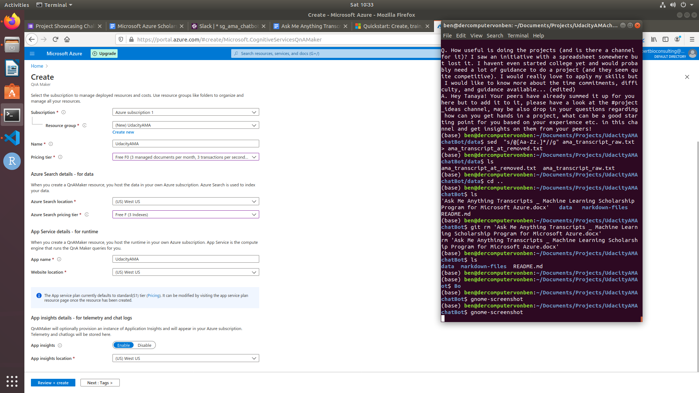
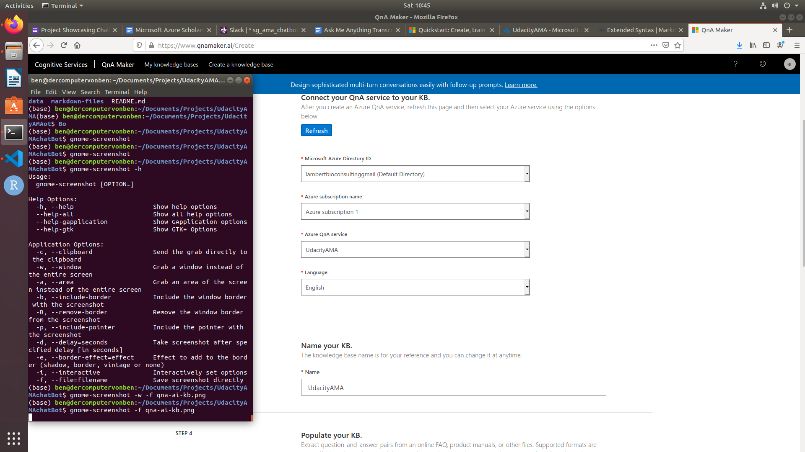
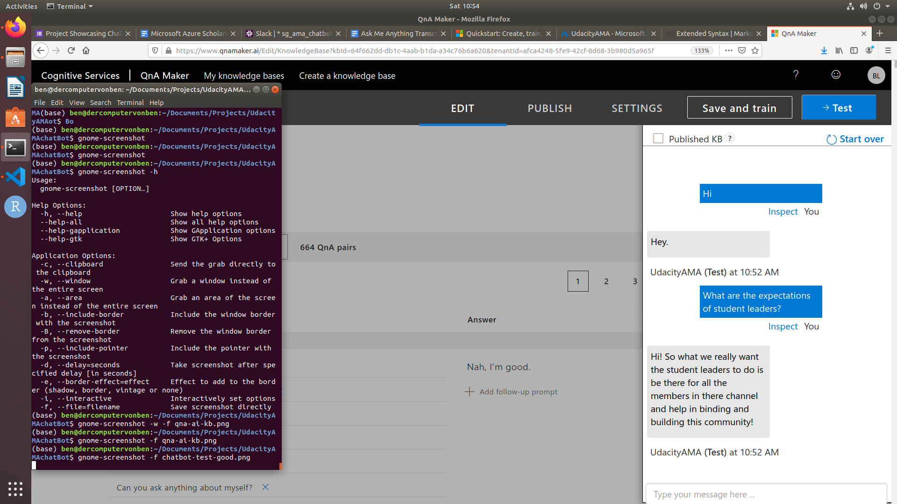
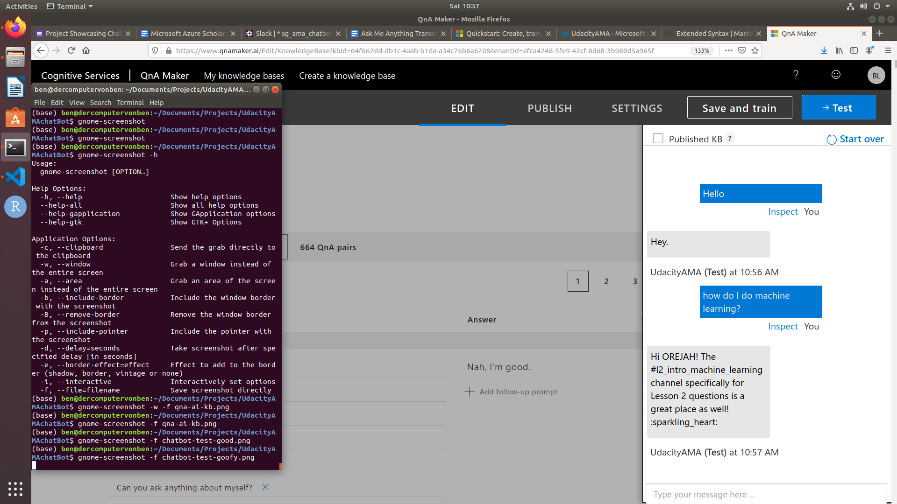
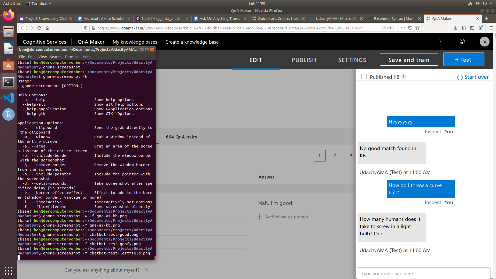

# Building a knowlege base

## 1.0 set up our resources.
Here I've tried to keep everything in the free tier.

Interestingly, after creating the resource group, you have to go to an entirely different website. (https://www.qnamaker.ai)

## 2.0 Extract QnA pairs and train bot.
At this new site head to "create knowlegebase".

Here you just enter the details of the resource that we just created in the Azure portal.

I converted everything to a .txt file to try to scrape out the @ symbols, but they require a .docx, .pdf, .tsv ... So I converted it back to .docx.

Then you can select the tone. I thought it would be funny to try 'witty'.

**Click 'save and train'**

## 3.0 Test the bot.

I thought it would be nice to lob some easy ones at the new chatbot.

Check out how well it handles some questions we would expect to be in the knowledge base.

Q: "what are the expectations of the student leaders?"

Let's challenge it with something goofy.

Q: "how do I do machine learning?"

To my surprise it actually came back with something valuable:

What we can see here though, is that the text extraction process retained the names that were not removed by my super simple scrape. I'm sure there is a much better way to remove Proper nouns from text or something like that. 

That actually surprised me, so let's really get out there.
Q: "How do I throw a curve ball?"

So our witty bot responds with its one out there response. 

Not perfect by any stretch, but it actually works a lot better than I would have thought given how little effort this has been.

Now select "PUBLISH" in the top bar and we can move on in the process!
